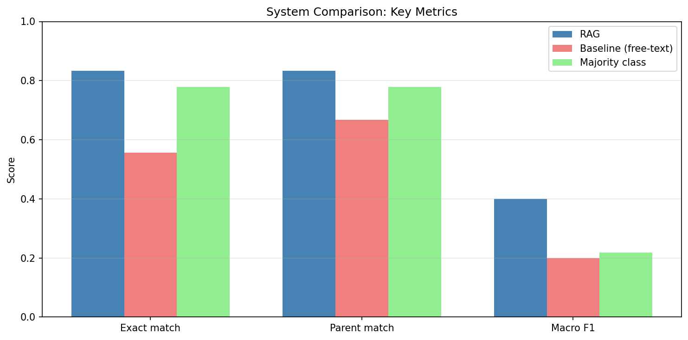
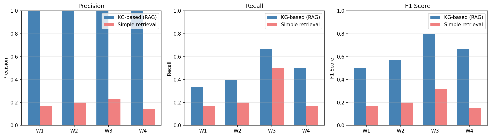
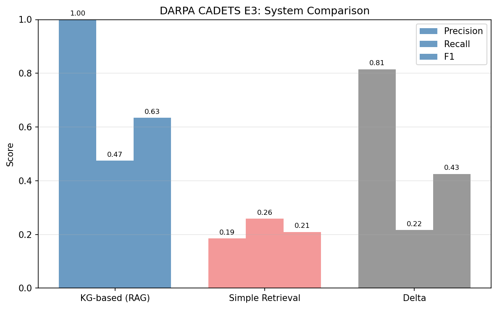

# RAG-Based Incident Reporting on SIEM Log Streams

Automated triage, knowledge graph construction, and structured incident report generation from SIEM-like log streams using local large language models, sentence embeddings, and retrieval-augmented generation grounded in the MITRE ATT&CK framework.

---

## Overview

Security Operations Center (SOC) analysts face high-volume alert streams that must be triaged, correlated, and escalated into actionable incident reports. Existing approaches depend on closed-source models or cloud APIs, creating privacy, latency, and licensing constraints for air-gapped or regulated environments.

This project implements a fully local, open-weight pipeline that:

1.  Converts raw SIEM log records into deterministic natural-language alert sentences.
2.  Embeds alerts with a sentence transformer and clusters them into incident communities via cosine-similarity community detection.
3.  Extracts semantic triples (subject, relation, target) from each community using a locally-deployed LLM with constrained JSON grammar.
4.  Constructs a knowledge graph that bridges behavioral triples to MITRE ATT&CK technique nodes.
5.  Retrieves relevant ATT&CK procedure descriptions from a ChromaDB vector store, using HyDE query expansion and KG-anchored candidate reranking.
6.  Generates structured incident reports with technique identification, evidence grounding, and suggested next steps.

The pipeline is evaluated on two public datasets -- **CIC-IDS-2017** (network flows) and **DARPA Transparent Computing** (host audit logs) -- across four open-weight LLMs.

---

## Pipeline Architecture

```
Raw SIEM / Audit Logs
        |
        v
[1] Alert Text Construction  -->  Deterministic NL sentences
        |
        v
[2] Sentence Embedding       -->  all-MiniLM-L6-v2 (384-dim)
        |
        v
[3] Community Detection      -->  Cosine threshold sweep + Louvain clustering
        |
        v
[4] Triple Extraction        -->  LLM + JSON grammar constraint
        |
        v
[5] Knowledge Graph         -->  NetworkX DiGraph (behavioral + ATT&CK bridge edges)
        |
        v
[6] RAG Retrieval           -->  ChromaDB + HyDE + KG-anchored reranking
        |
        v
[7] Report Generation       -->  Structured incident report (technique, evidence, next step)
```

### Stage Details

| Stage | Description |
|-------|-------------|
| **1. Alert Text Construction** | Converts structured log fields into short natural-language sentences using a deterministic mapping (port-to-service, protocol, ATT&CK tactic hints). No LLM involved -- embeddings remain stable across runs. |
| **2. Sentence Embedding** | Encodes alert sentences into 384-dimensional vectors using `sentence-transformers/all-MiniLM-L6-v2`. |
| **3. Community Detection** | Computes pairwise cosine similarity across embeddings, then applies `community_detection()` (greedy modularity) with a threshold sweep. Optimal threshold selected by combined purity-similarity score. |
| **4. Triple Extraction** | For each malicious-dominant community, the local LLM extracts 1-4 semantic triples `(subject, relation, target)` constrained by a JSON grammar. Relations are domain-specific (e.g., `PERFORMS_PORT_SCAN`, `EXPLOITS_VULNERABILITY`, `ESTABLISHES_C2`). |
| **5. Knowledge Graph Construction** | Builds a NetworkX directed graph with behavioral nodes (subjects, targets), ATT&CK technique nodes (from MITRE STIX bundle), and two edge types: behavioral edges from triples and bridge edges via a `RELATION_TO_TECHNIQUES` mapping. |
| **6. RAG Retrieval** | Retrieves top-10 ATT&CK procedure descriptions from ChromaDB. Uses HyDE (Hypothetical Document Embedding) for query expansion and KG-anchored candidate reranking (scoped by the dominant relation's mapped techniques). |
| **7. Report Generation** | LLM generates a structured JSON report `{technique_id, tactic, summary, evidence, next_step}` with grounding against the retrieved context. Evaluated for exact match, parent match, macro-F1, faithfulness, and evidence grounding. |

---

## Repository Structure

```
.
+-- src/
|   +-- semantic_alerts.py          # Deterministic NL alert builder (port/service mapping, ATT&CK hints)
+-- notebook_CIC-IDS/               # CIC-IDS-2017 notebooks (one per model)
|   +-- CIC_IDS_v1.ipynb            #     Reference implementation
|   +-- CIC_IDS_v1_mistral-nemo-12b.ipynb
|   +-- CIC_IDS_v1_qwen2.5-3b.ipynb
|   +-- CIC_IDS_v1_qwen2.5-coder-7b.ipynb
+-- notebook_DARPA/                 # DARPA TC notebooks (one per model)
|   +-- DARPA_v1.ipynb              # Reference implementation
|   +-- DARPA_v1_mistral-nemo-12b.ipynb
|   +-- DARPA_v1_qwen2.5-3b.ipynb
|   +-- DARPA_v1_qwen2.5-coder-7b.ipynb
+-- results/                        # Evaluation outputs and figures (per model)
|   +-- mistral-nemo-12b/
|   |   +-- figures/                #     8 plots (4 CIC-IDS + 4 DARPA)
|   |   +-- rag_metrics.json        #     RAG evaluation metrics
|   |   +-- clustering_metrics.json #     Clustering quality
|   |   +-- knowledge_graph_metrics.json
|   |   +-- knowledge_graph.graphml #     Serialized KG
|   |   +-- triple_metrics.json     #     Triple extraction quality
|   |   +-- report_quality.json     #     Report faithfulness scores
|   |   +-- darpa_comparison_metrics.json
|   |   +-- rag_reports.csv         #     Generated incident reports
|   |   +-- threshold_sweep.csv     #     Clustering threshold sweep
|   +-- qwen2.5-3b/                 # Same structure
|   +-- qwen2.5-coder-7b/           # Same structure
+-- data/                           # Datasets (gitignored)
+-- models/                         # GGUF model files (gitignored)
+-- chromadb/                       # Vector store (gitignored)
+-- src/semantic_alerts.py
+-- test.py
+-- README.md
```

---

## Datasets

### CIC-IDS-2017

Network traffic dataset containing benign traffic and seven attack types (DDoS, Port Scan, Brute Force, Web Attack, Infiltration, Botnet, Heartbleed). Processed from the original PCAP/CSV format using stratified sampling (2,000 samples per label, filtered to Monday and Wednesday windows).

**Ground truth:** ATT&CK technique labels assigned via a STIX 2.1 mapping from CIC-IDS label names to MITRE technique IDs.

### DARPA Transparent Computing (CADETS E3)

Host audit log dataset capturing red-team activity across four time windows (W1-W4), each with known adversarial infrastructure (IPs, file paths) and ground-truth ATT&CK technique sets (observable and campaign-level). Events are CDM-formatted (Subject, Event, FileObject, NetFlowObject) with system call-level granularity.

**Ground truth:** Per-window ATT&CK technique sets as documented in the official DARpa TC ground-truth reports.

---

## Models Evaluated

| Model | Parameters | Quantization | File Size | Rationale |
|-------|-----------|-------------|-----------|-----------|
| Mistral-Nemo-Instruct-2407 | 12B | Q5_K_M | ~8 GB | Strong instruction following; Mistral ecosystem maturity |
| Qwen2.5-Coder-7B-Instruct | 7B | Q5_K_M | ~5 GB | Code-oriented training may improve structured output compliance |
| Qwen2.5-3B-Instruct | 3B | Q4_K_M | ~2 GB | Minimal resource footprint for constrained environments |
All models are loaded via `llama-cpp-python` with GPU offloading and run entirely locally on an NVIDIA RTX 3070 Ti (8 GB VRAM).

---

## Results

### Clustering Quality

Clustering is a pre-LLM stage and is identical across all model evaluations.

| Metric | Value |
|--------|-------|
| Cosine threshold | 0.80 |
| Communities detected | 54 |
| Unclustered alerts | 5 |
| Label purity (malicious vs benign) | 0.837 |
| Intra-cluster cosine similarity | 0.938 |

### RAG Evaluation (CIC-IDS-2017)

Exact match and parent match measure whether the LLM-assigned technique ID (or its parent, for sub-techniques) matches the ground truth. Macro-F1 averages per-class F1 scores. Faithfulness measures the proportion of report claims attributable to the retrieved context.

| Metric | Mistral-Nemo-12B | Qwen2.5-Coder-7B | Qwen2.5-3B |
|--------|:----------------:|:----------------:|:----------:|
| RAG Exact Match Rate | **0.833** | 0.111 | 0.278 |
| RAG Parent Match Rate | **0.833** | 0.111 | 0.278 |
| Baseline Exact Match Rate | 0.556 | 0.000 | 0.000 |
| Delta (RAG - Baseline) Exact | **+0.278** | +0.111 | +0.278 |
| RAG Macro-F1 | **0.400** | 0.200 | 0.114 |
| Baseline Macro-F1 | 0.200 | 0.000 | 0.000 |
| Faithfulness (mean) | 0.471 | **0.620** | 0.519 |
| Retrieval Hit Rate | **0.833** | 0.111 | 0.278 |

*Figure: CIC-IDS metrics comparison across models.*


### Report Quality (CIC-IDS-2017)

| Metric | Mistral-Nemo-12B | Qwen2.5-Coder-7B | Qwen2.5-3B |
|--------|:----------------:|:----------------:|:----------:|
| Reports generated | 18 | 18 | 18 |
| Completeness rate | 1.0 | 1.0 | 1.0 |
| Summary grounding (mean) | **0.733** | 0.728 | 0.724 |
| Evidence grounding (mean) | 0.568 | **0.744** | 0.634 |
| Name consistency rate | 0.944 | **1.000** | **1.000** |

### DARPA TC Evaluation (Per-Window KG-Based ATT&CK Mapping)

Macro-averaged precision, recall, and F1 across the four attack windows (W1-W4). The KG-based system uses triple extraction + relation-to-technique mapping. Baseline is simple embedding similarity retrieval.

| Metric | Mistral-Nemo-12B | Qwen2.5-Coder-7B | Qwen2.5-3B |
|--------|:----------------:|:----------------:|:----------:|
| KG Precision | **1.000** | **1.000** | 0.958 |
| KG Recall | 0.475 | **0.558** | **0.558** |
| KG Macro-F1 | 0.635 | **0.710** | 0.685 |
| Baseline Macro-F1 | 0.209 | 0.272 | 0.254 |
| Delta F1 | +0.425 | **+0.438** | +0.431 |
| KG F1 95% CI | [0.536, 0.743] | [0.619, 0.800] | [0.595, 0.792] |

*Figure: DARPA per-window comparison (KG-based vs simple retrieval).*


*Figure: DARPA summary metrics across all windows.*


### Knowledge Graph Coverage

| Metric | Mistral-Nemo-12B | Qwen2.5-Coder-7B | Qwen2.5-3B |
|--------|:----------------:|:----------------:|:----------:|
| Behavioral nodes | 52 | 52 | 52 |
| ATT&CK nodes reachable | 7 | **12** | 4 |
| Relation coverage | 3 / 7 | **6 / 7** | 3 / 7 |

### Key Findings

1.  **Knowledge graph grounding consistently improves retrieval** across all models and both datasets. The delta over simple embedding retrieval ranges from +0.111 to +0.278 exact match on CIC-IDS and +0.425 to +0.438 macro-F1 on DARPA TC.

2.  **Mistral-Nemo-12B achieves the highest RAG accuracy** on CIC-IDS (83.3% exact match, 0.400 macro-F1), likely due to its larger parameter count and instruction-tuning quality.

3.  **Qwen2.5-Coder-7B demonstrates superior structural understanding** on DARPA TC: highest KG F1 (0.710), richest relation coverage (6/7), most ATT&CK nodes reachable (12), and highest faithfulness (0.620).

4.  **Smaller models benefit proportionally more from KG grounding.** Qwen2.5-3B goes from 0% baseline accuracy to 27.8% with KG anchoring on CIC-IDS, a gain of +0.278.

5.  **The DARPA TC dataset is more challenging** than CIC-IDS-2017 for this pipeline, as evidenced by lower overall accuracy and higher variance across models. This reflects the complexity of host-level audit log analysis versus network flow classification.

---

## Getting Started

### Prerequisites

- Python 3.10+
- NVIDIA GPU with 4+ GB VRAM (optional but recommended)
- Conda or virtual environment

### Installation

```bash
# Clone the repository
git clone https://github.com/Joel89899/RAG-Based-Incident-Reporting-on-SIEM-Log-Streams.git
cd RAG-Based-Incident-Reporting-on-SIEM-Log-Streams

# Create and activate environment
conda create -n thesis python=3.11
conda activate thesis
# Dependencies are installed per-notebook via pip install cells.
# See individual notebooks for the full list of required packages.
```

### Download Models and Data

Download the GGUF model files to `models/`:

| Model | Source |
|-------|--------|
| Mistral-Nemo-Instruct-2407 (Q5_K_M) | [huggingface.co/bartowski](https://huggingface.co/bartowski/Mistral-Nemo-Instruct-2407-GGUF) |
| Qwen2.5-Coder-7B-Instruct (Q5_K_M) | [huggingface.co/Qwen](https://huggingface.co/Qwen) |
| Qwen2.5-3B-Instruct (Q4_K_M) | [huggingface.co/Qwen](https://huggingface.co/Qwen) |

Datasets should be placed in `data/`:

- **CIC-IDS-2017:** Download from the [CIC dataset repository](https://www.unb.ca/cic/datasets/ids-2017.html). Place CSV files in `data/cicids/`.
- **DARPA TC CADETS E3:** Request access from [DARPA Transparent Computing](https://github.com/darpa-i2o/Transparent-Computing). Place JSON files in `data/darpa/ta1-cadets-e3-official*/`.
- **MITRE ATT&CK:** Download `enterprise-attack.json` from the [MITRE CTI repository](https://github.com/mitre/cti). Place in `data/attck/`.

### Usage

Open the appropriate notebook for your dataset and model of choice:

```bash
# CIC-IDS-2017 with Mistral-Nemo-12B
jupyter notebook notebook_CIC-IDS/CIC_IDS_v1_mistral-nemo-12b.ipynb

# DARPA TC with Qwen2.5-Coder-7B
jupyter notebook notebook_DARPA/DARPA_v1_qwen2.5-coder-7b.ipynb
```

Each notebook is self-contained and runs the full pipeline end-to-end: data loading, alert construction, embedding, clustering, triple extraction, knowledge graph construction, RAG retrieval, and report generation.

---

## Customization

### Adding a new model

1.  Download the GGUF file to `models/`.
2.  Copy an existing notebook (e.g., `CIC_IDS_v1_mistral-nemo-12b.ipynb`).
3.  Update `MODEL_FILENAME` and `RESULTS_DIR` in the setup cell.
4.  Adjust the LLM initialization parameters as needed.

### Adding a new dataset

1.  Place raw data in `data/`.
2.  Implement a data-loading cell following the patterns in the existing notebooks.
3.  Adapt the alert text construction to your log format.
4.  Define ground-truth labels and (optionally) time windows for evaluation.

---

## Citation

If you use this work in your research, please cite:

```
@mastersthesis{mwende2025rag,
  author  = {Joel Isaria Mwende},
  title   = {RAG-Based Incident Reporting on SIEM Log Streams},
  school  = {SRH University of Applied Sciences},
  year    = {2025}
}
```

---

## License

This project is provided for academic and research purposes. See the `LICENSE` file for details.

---

## Acknowledgments

- Prof. Dr. Klaus Dieter Schwarz, SRH University, for supervision and methodological guidance.
- The MITRE Corporation, for the ATT&CK framework and STIX data.
- Canadian Institute for Cybersecurity, for the CIC-IDS-2017 dataset.
- DARPA, for the Transparent Computing program and CADETS dataset.
